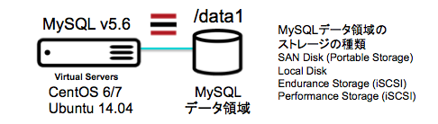
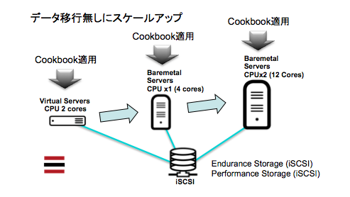

mysql01 Cookbook
================

MySQL 5.6 コミュニティ・エディションをダウンロードしてインストールするクックブックです。
このクックブックでは、LinuxディストリビューションのMySQLを利用せず、https://dev.mysql.com/downloads/mysql/ から MySQL v5.6 を入手します。そして、データ領域を "/data1" に作成します。 このため "/data1" をポータブルストレージやiSCSIストレージに設定すれば、サーバーのスケールアップが容易になります。


システム構成
------------





Requirements
------------
TODO: List your cookbook requirements. Be sure to include any requirements this cookbook has on platforms, libraries, other cookbooks, packages, operating systems, etc.

e.g.
#### packages
- `toaster` - mysql01 needs toaster to brown your bagel.

Attributes
----------
TODO: List your cookbook attributes here.

e.g.
#### mysql01::default
<table>
  <tr>
    <th>Key</th>
    <th>Type</th>
    <th>Description</th>
    <th>Default</th>
  </tr>
  <tr>
    <td><tt>['mysql01']['bacon']</tt></td>
    <td>Boolean</td>
    <td>whether to include bacon</td>
    <td><tt>true</tt></td>
  </tr>
</table>

Usage
-----
#### mysql01::default
TODO: Write usage instructions for each cookbook.

e.g.
Just include `mysql01` in your node's `run_list`:

```json
{
  "name":"my_node",
  "run_list": [
    "recipe[mysql01]"
  ]
}
```

Contributing
------------
TODO: (optional) If this is a public cookbook, detail the process for contributing. If this is a private cookbook, remove this section.

e.g.
1. Fork the repository on Github
2. Create a named feature branch (like `add_component_x`)
3. Write your change
4. Write tests for your change (if applicable)
5. Run the tests, ensuring they all pass
6. Submit a Pull Request using Github

License and Authors
-------------------
Authors: TODO: List authors
